# RoboHand V2 (RH-2W)

  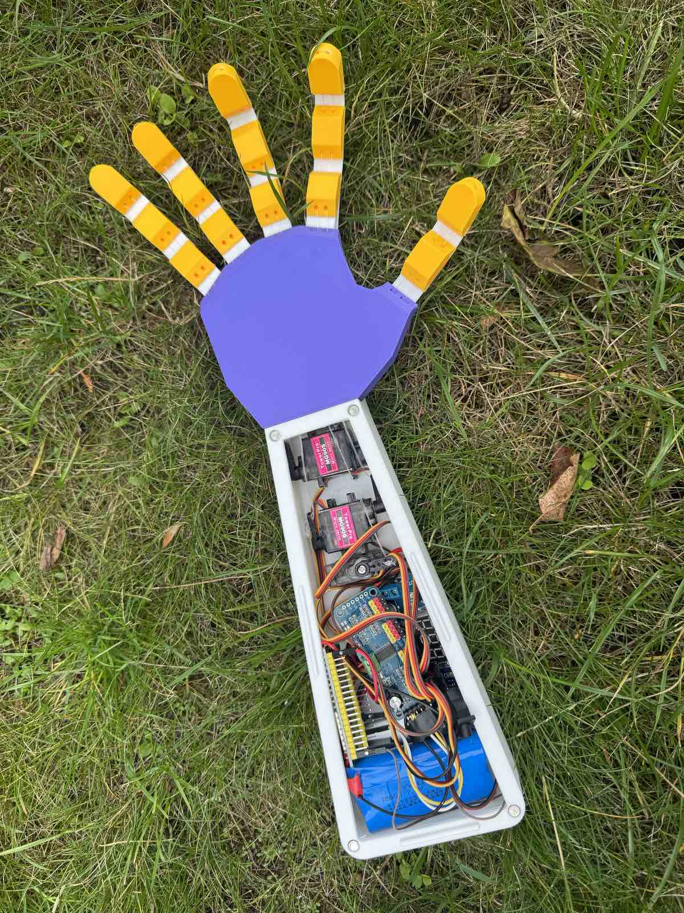

3D-printed tendon-driven robotic hand with a **wearable Hand Controller**.

Five analog joysticks on a glove follow your fingers. An ESP32 on the glove sends the values over **ESP-NOW**. A second ESP32 in the forearm drives five **MG90S** servos through a **PCA9685**. Fingers close on fishing-line tendons and open on printed **TPU 95A** return links.

Print files: [RoboHandV2 with wearable HandController on MakerWorld](https://makerworld.com/en/models/3312121-robohandv2-with-wearable-handcontroller#profileId-3760254)

Version 1 (button remote): [MakerWorld](https://makerworld.com/en/models/2298640-robohand) · [GitHub](https://github.com/kponomareva452-hue/RoboHand)

---

## Photos

  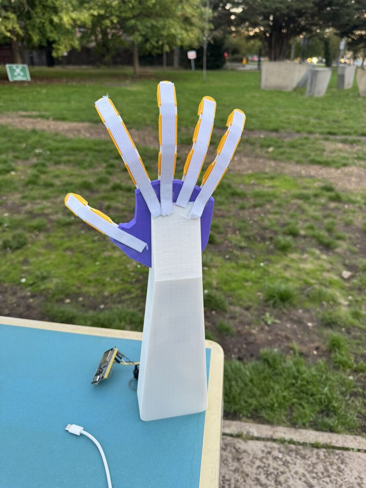
  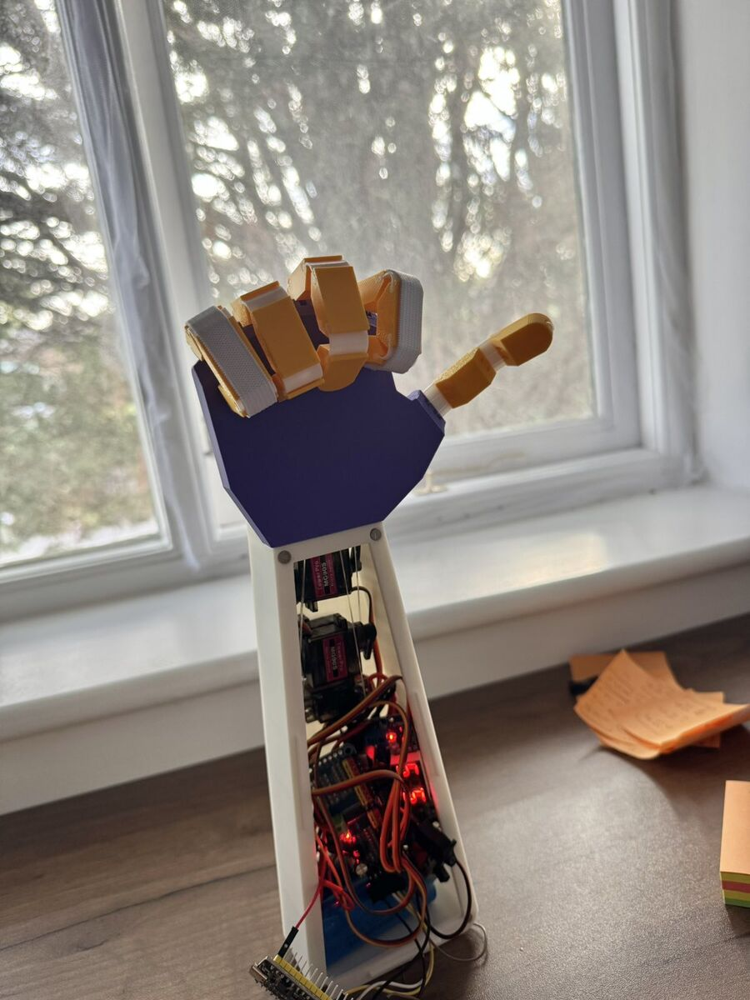

  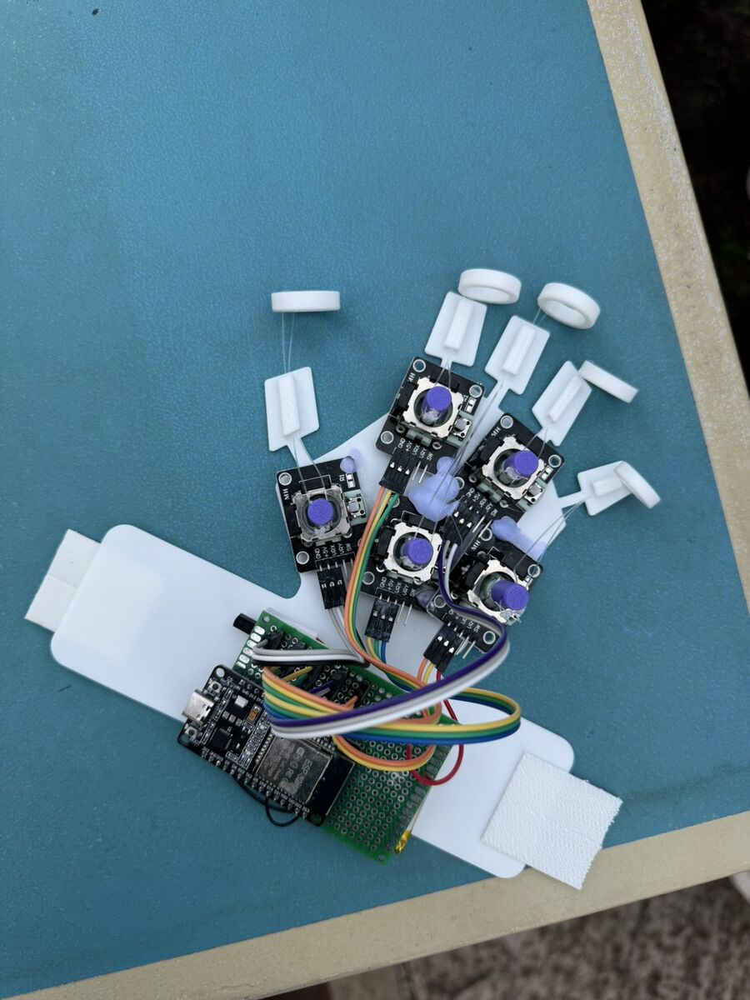
  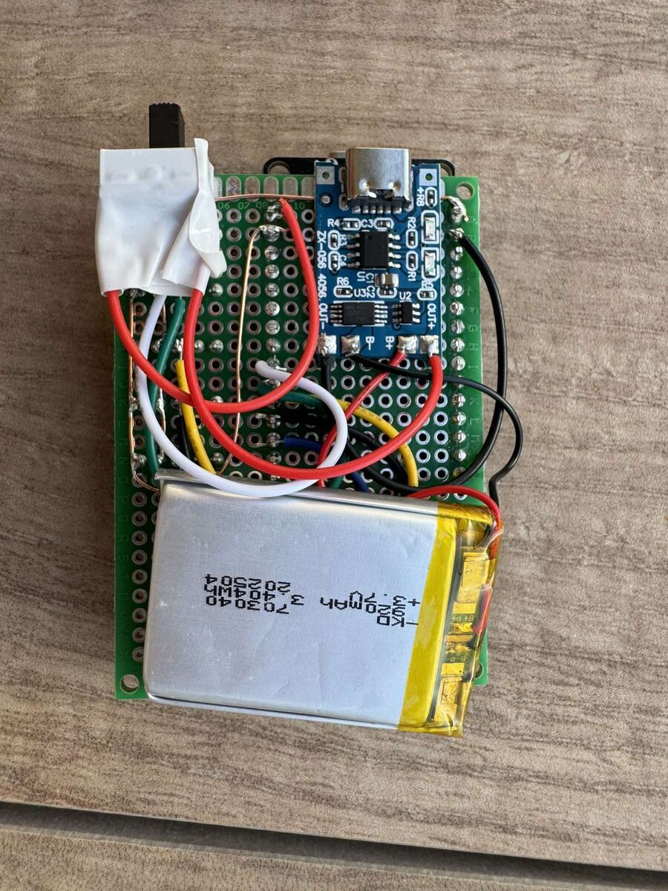

  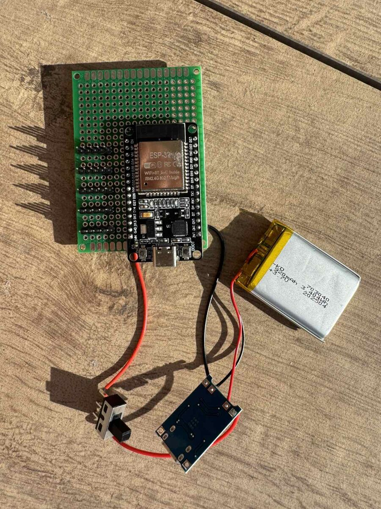
  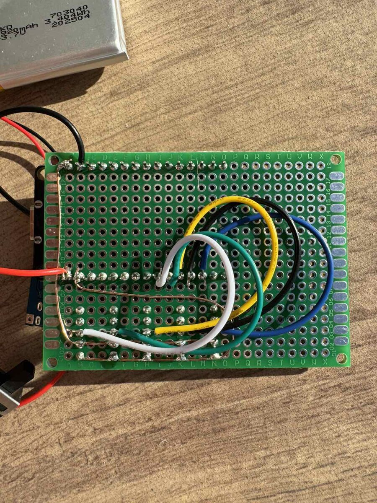

  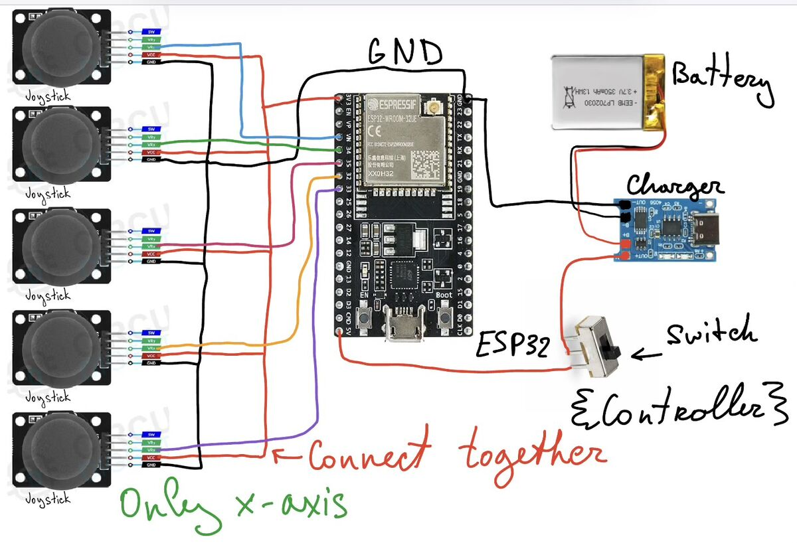
  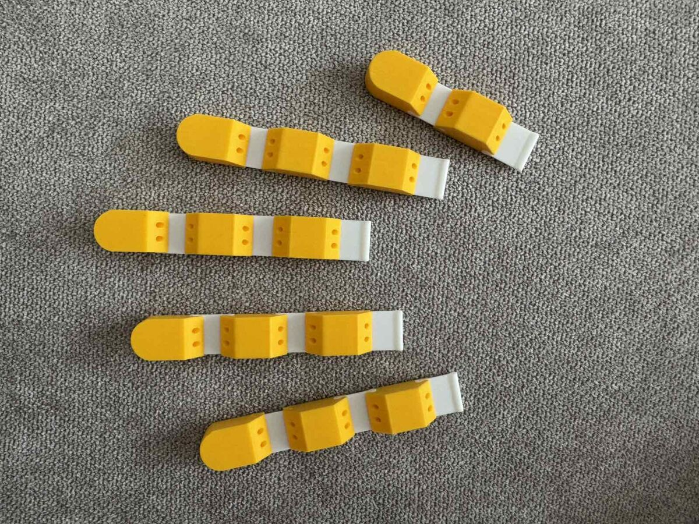

  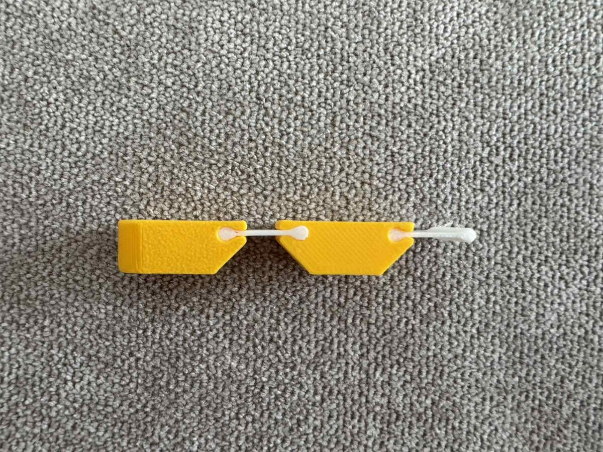
  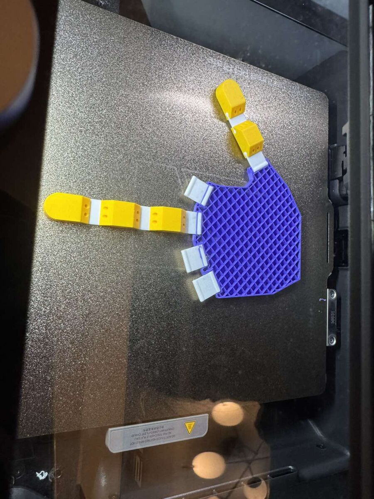

  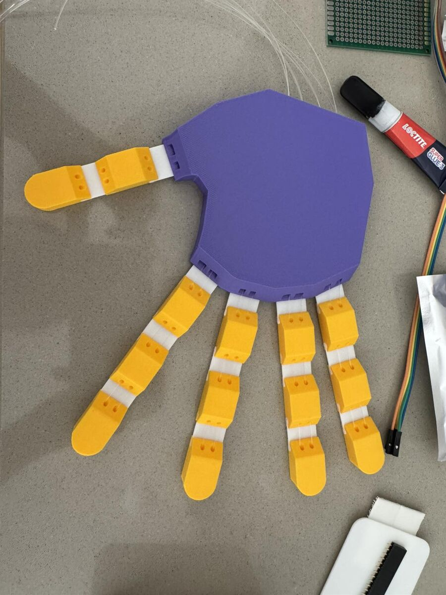
  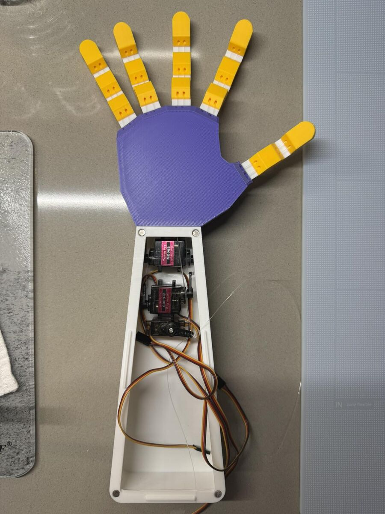

  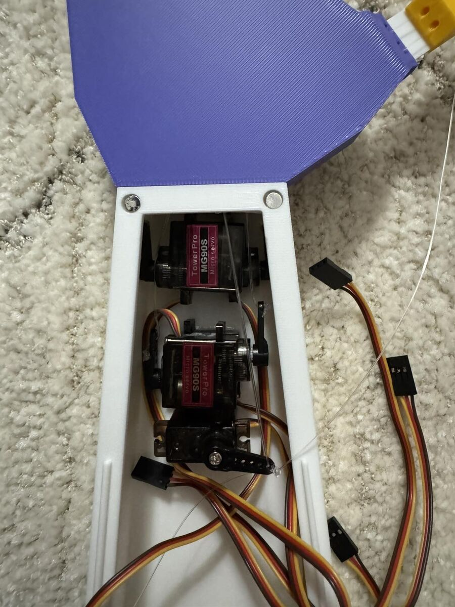

---

## What is in this repo

| File | Board | Job |
|---|---|---|
| `firmware/RoboHand_V2_Controller_Sender/` | Glove ESP32 | Read 5 joysticks, send ESP-NOW |
| `firmware/RoboHand_V2_Hand_Receiver/` | Hand ESP32 | Receive packet, drive PCA9685 |
| `firmware/RoboHand_ServoCalibrator/` | Hand ESP32 | Live pulse test over Serial |
| `firmware/RoboHand_FingerValues/` | Hand ESP32 | Edit open/close values in code |
| `RoboHandV2.3mf` | — | Print plates |

---

## HandController pins

X-axis only. VCC = **3V3**. Do not put 5 V on the joysticks.

| Finger | GPIO |
|---|---|
| Thumb | 33 |
| Index | 32 |
| Middle | 35 |
| Ring | 34 |
| Pinky | 39 |

Power on the glove: 3.7 V LiPo to USB-C charger board to switch to ESP32 **5V** pin. Common GND.

---

## Hand wiring

- 7.4 V Li-ion (Deans T-plug) to 3 A fuse to switch to **LM2596** set to about 6 V
- LM2596 output to PCA9685 **V+** and a 1000 µF capacitor
- Hand ESP32 from a USB power bank, not from the servo rail
- I2C: SDA **21**, SCL **22**, PCA9685 address `0x40`
- Servos on channels **0-4** (Thumb to Pinky)
- Thumb, Ring, Pinky are reversed in `invert[]`

---

## Flash order

1. Arduino IDE, ESP32 board package, library **Adafruit PWM Servo Driver**.
2. Upload the receiver to the hand ESP32. Open Serial at 115200. Copy the printed MAC.
3. Paste that MAC into `receiverMac[]` in the sender.
4. Upload the sender to the glove.
5. If a servo buzzes, power off and shrink `openPulse` / `closePulse`.

Safe pulse window for MG90S at 50 Hz: about **90-560**. Start smaller.

Print: PETG bones, TPU 95A return links, 0.2 mm, 2 walls, 15% infill.

---

## Safety

Do not power five servos from the ESP32 5 V pin. Stop if a servo hums while it is not moving. Charge LiPo / 2S packs with a proper charger.

Firmware: MIT. Printed parts: use and remix with credit. Not a medical device.
